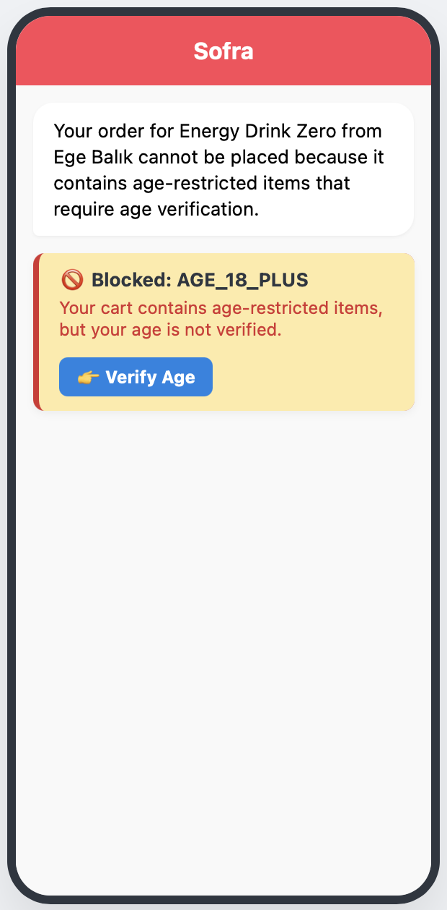
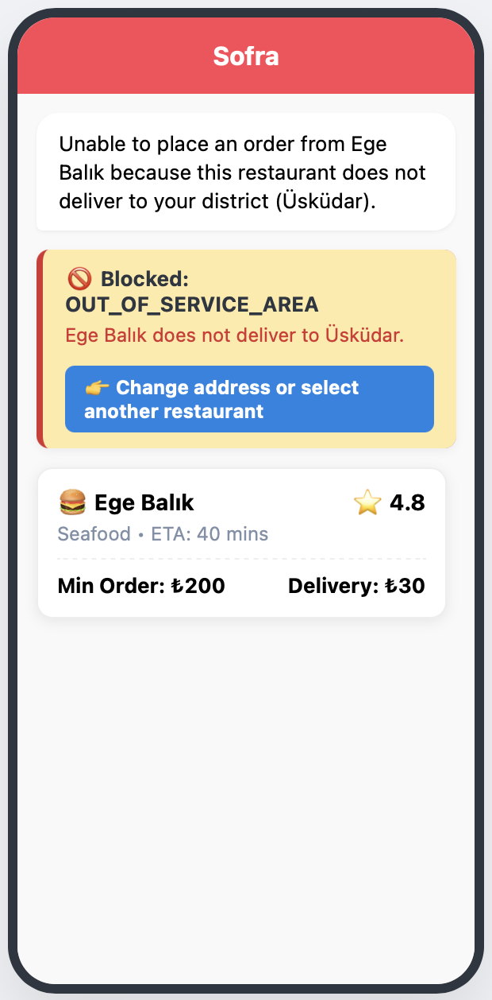
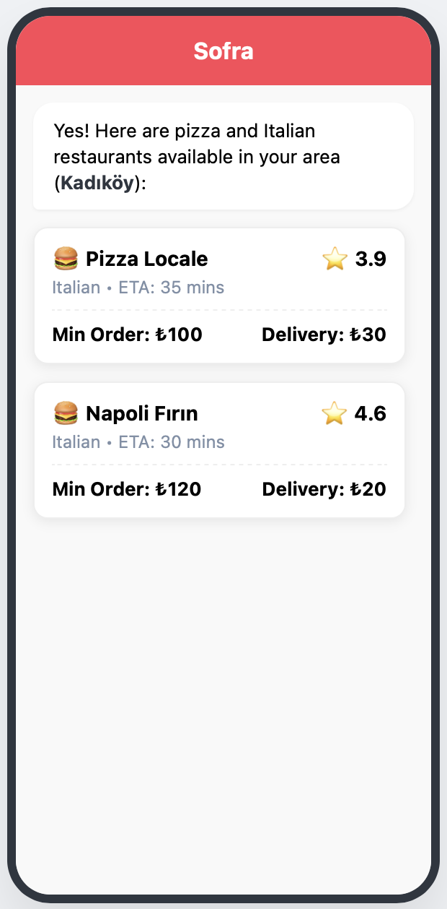
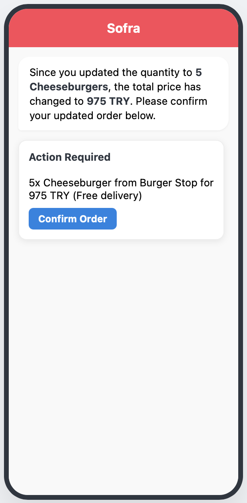
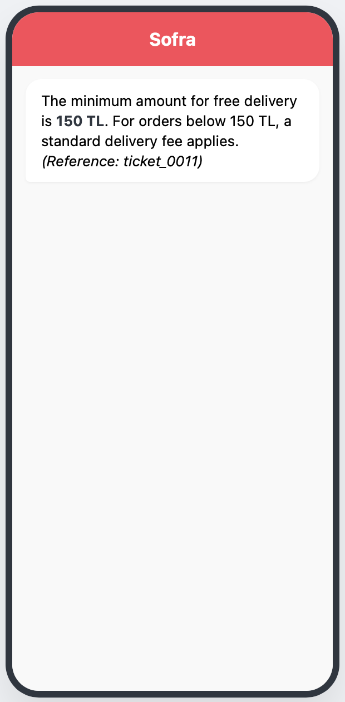
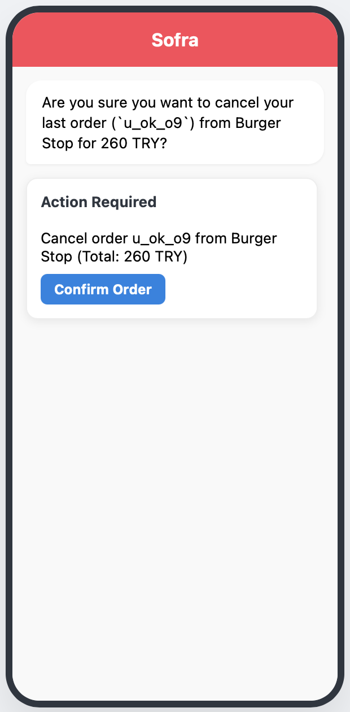
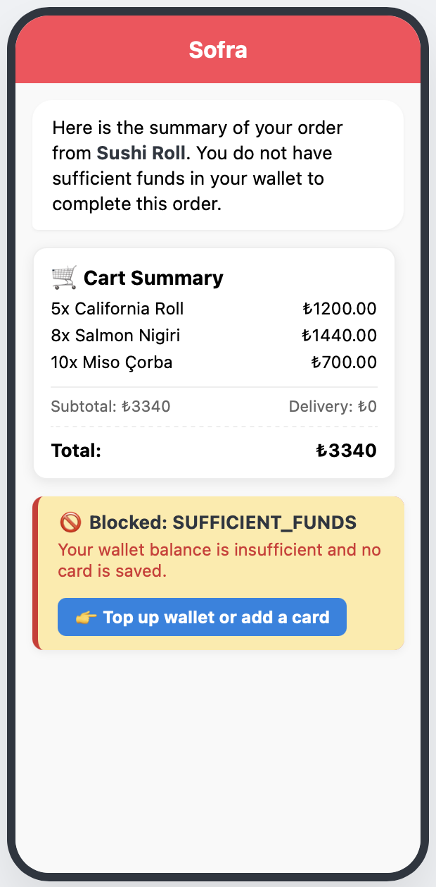
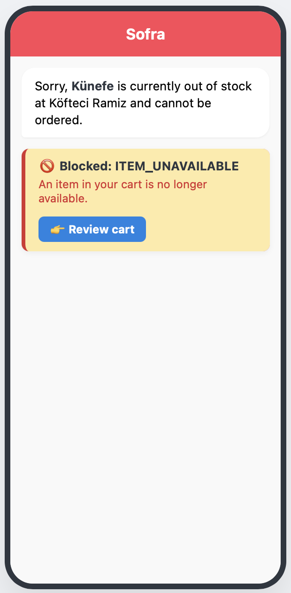
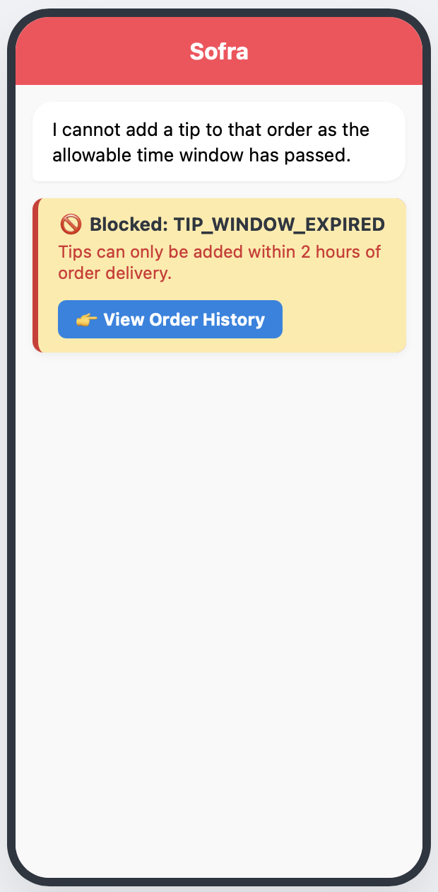

# Sofra Food Delivery AI Assistant & Generative UI Engine

Sofra is a state-aware food delivery assistant built on a custom Generative UI architecture to connect natural language inputs with strict, deterministic business rules. 

This repository demonstrates how to manage complex multi-turn transactions, validation gates, cryptographic token binding and prompt injection defenses in a production-grade LLM application.

---

## Architecture & Core Design Decisions

When building a transaction-heavy agent, the LLM cannot be trusted with final business logic. The architecture strictly separates natural language understanding from deterministic execution. During the design phase, our primary focus was on fail-safe defaulting, idempotency for sensitive actions and strict decoupling of the AI from the core calculation engines.

### 1. Software Patterns Applied
To keep the codebase maintainable and the AI completely restricted from business logic, several core software patterns were implemented:
* **Decorator Pattern (Verification Gates):** Sensitive tools are wrapped with Python decorators (e.g., `@requires_funds`, `@age_restricted`). This enforces business logic at the routing layer, short-circuiting the LLM entirely if a condition fails before the tool is even executed.
* **Factory & Registry Patterns (UI Engine):** The Generative UI does not rely on hardcoded switch statements. UI blocks are registered in a central component registry. When the LLM outputs a specific block type, a factory dynamically instantiates the correct Pydantic model.
* **State Machine (Context Injection):** The LLM is stateless and does not "remember" the cart. The cart is maintained as a strict backend state machine. The current state is serialized and injected into the system prompt at every turn ensuring the AI always operates on the absolute source of truth.
* **Strategy Pattern (Retrieval):** The retrieval mechanism dynamically switches strategies between SQL querying for live menu items and BM25 sparse retrieval for static policy documents based on the user's intent.

### 2. Why Python?
Python was chosen primarily for its established ecosystem in AI integration and rapid prototyping. It allows seamless orchestration between the LLM API layer, local deterministic tool execution and the JSON-driven Generative UI frontend via Pydantic.

### 3. The LLM Choice: From Anthropic to Google Gemini
The project initially used Anthropic's Claude during early prototyping due to its reliable handling of structured JSON outputs. However, the implementation later migrated to Google Gemini (specifically `gemini-3.6-flash`) driven by three engineering requirements:
* **Tool-Calling Latency & Concurrency:** Fast parallel tool-calling performance is essential for multi-turn flows (searching restaurants, retrieving menus and updating cart states).
* **Context Window Capacity:** Food delivery requires injecting extensive system instructions, active user profiles and large restaurant menus into the context. Gemini handles large token volumes reliably without degrading instruction adherence.
* **Cost Efficiency:** The API is currently available for free, completely eliminating LLM inference costs during development and early scaling phases.

### 4. Pydantic for Strict Schema Enforcement
LLMs are probabilistic, but UI renderers crash on unexpected data. We use Pydantic to dynamically compile a strict JSON schema (`UIResponse`) and inject it into the system prompt. This guarantees the LLM only outputs validated, strongly-typed UI blocks acting as a reliable bridge to the frontend simulator.

### 5. Deterministic Money Calculation Engine
LLMs frequently hallucinate arithmetic. In this system, the LLM only extracts user intent (e.g., "add 2 burgers"). The actual math—fetching prices, calculating subtotals and checking delivery minimums—happens in deterministic Python functions.

### 6. The Verification Gates Pattern
To prevent prompt injection from bypassing business rules (e.g., a minor trying to buy restricted items), we implemented Verification Gates. When the LLM attempts a sensitive action, the Python backend intercepts the call, checks database constraints (age, balance, service area) and short-circuits the LLM if a rule fails returning a hardcoded UI block. 

### 7. Safe vs. Sensitive Tools
* **Safe Tools:** (e.g., `search_restaurants`, `get_cart`) Executed autonomously by the AI.
* **Sensitive Tools:** (e.g., `place_order`, `cancel_order`) Locked behind a two-phase commit. The AI can prep the payload, but execution requires explicit user confirmation via a rendered UI button.

### 8. Cryptographic Parameter Binding (HMAC)
To avoid managing stateful sessions, checkout confirmations use HMAC-SHA256 tokens. The token cryptographically binds the exact cart parameters (items, quantities and prices). If a user attempts to alter the payload (e.g., changing quantities) before confirming, the signature fails. Tokens are also single-use with strict expiration timestamps to guarantee idempotency.

### 9. Knowledge Base Retrieval (BM25)
For policy queries, we use BM25 sparse retrieval instead of dense vector embeddings. Policy documents (e.g., "ticket_0011") require exact keyword matching ("150 TL", "free delivery"). Dense embeddings often retrieve semantically similar but factually irrelevant documents. Additionally, live user state (active cart or wallet) is explicitly programmed to override stale RAG data.

### 10. Component Catalog Design
The Generative UI strictly avoids hardcoded rendering logic. It utilizes a central component catalog (e.g., `RestaurantCard`, `CartSummary`, `VerificationGate`). When the AI signals a specific UI requirement, the backend dynamically instantiates the corresponding Pydantic schema from the catalog, ensuring the frontend only ever receives predictable, strongly-typed JSON objects.

### 11. Latency & Streaming Considerations
Verification Gates drastically reduce latency by short-circuiting invalid requests locally before triggering an LLM re-evaluation. While standard text generation supports streaming, strict Generative UI presents challenges. Because the frontend relies on structured JSON components to render UI cards, the backend must buffer the tool call output to ensure full schema validity before pushing to the client, prioritizing structural integrity over token-by-token streaming.

### 12. Security Model Summary
The system assumes the LLM is a potentially compromised interface and relies on strict backend enforcement. By combining zero-trust tool execution (Point 7), cryptographic parameter binding (Point 8) and backend verification gates (Point 6), the architecture ensures that prompt injection attacks cannot force unauthorized transactions or bypass business rules.

---

## Future Work & Production Scaling

To scale this architecture for high-traffic production environments, the following upgrades would be prioritized:
* **Distributed State Management:** Move the in-memory cart and session states to Redis for low-latency, distributed access across multiple worker nodes.
* **Asynchronous Task Queues:** Implement an asynchronous message brokering architecture using RabbitMQ to handle high-throughput order queuing, notifications and background processing without blocking the main event loop.
* **Authentication Middleware:** Replace the mocked user profile injection with robust OAuth2/JWT middleware, cryptographically binding the active user ID to all backend tool executions.

---

## Comprehensive Test Matrix & UI Outputs

The following test cases demonstrate the validation gates, token binding and RAG systems in practice.

### 1. Age Restriction Gate (age_18_plus)
The system detects an age-restricted item and short-circuits the flow because the user's profile is unverified.
* **Input:** "Order 1 energy drink from Ege Balık"
<br>


### 2. Out of Service Area Gate (out_of_service_area)
The user attempts to order from a restaurant outside their delivery zone. The backend intercepts the call and renders alternatives.
* **Input:** "Order from Ege Balık" (User is in Üsküdar, Restaurant is in Beşiktaş)
<br>


### 3. Spatial & Restaurant Filtering
Demonstrates the LLM querying the backend with the user's location, applying filters (Italian) and rendering UI components.
* **Input:** "Is there a pizza place near me?"
<br>


### 4. Token Binding & Re-Quoting
The user attempts to change parameters during the confirmation phase. The system rejects the old payload, recalculates the deterministic total and generates a new HMAC token.
* **Input:** "Confirm, but make it 5 cheeseburgers"
<br>


### 5. Knowledge Base Retrieval (RAG via BM25)
The assistant fetches exact policy rules from the knowledge base without hallucinating numbers.
* **Input:** "What is the minimum amount for free delivery?"
<br>


### 6. Order Cancellation (Sensitive Action)
Cancellation requires explicit, tokenized user consent. The AI cannot execute this unilaterally.
* **Input:** "Cancel my last order"
<br>


### 7. Insufficient Funds Gate (sufficient_funds)
The deterministic engine calculates a total of 3340 TRY. The validation gate checks the user's wallet, finds it lacking and blocks the transaction.
* **Input:** "Order 5 California Roll, 8 Salmon Nigiri, 10 Miso Çorba from Sushi Roll"
<br>


### 8. Item Unavailable Gate (item_unavailable)
Intercepts orders for out-of-stock items before they reach the cart calculation phase.
* **Input:** "Order künefe from Köfteci Ramiz"
<br>


### 9. Tip Window Expired Gate (tip_window_expired)
Validates time-based business rules for sensitive actions.
* **Input:** "Add a 50 TL tip to my order from yesterday"
<br>


---

## Getting Started

### Prerequisites
* Python 3.10+
* Google Gemini API Key (`gemini-3.6-flash`)

### Installation & Execution
```bash
git clone https://github.com/iaduru/sofra-assistant.git
cd sofra-assistant
python -m venv venv
source venv/bin/activate
pip install -r requirements.txt

# Configure environment
echo "GEMINI_API_KEY=your_key_here" > .env

# Run the CLI Assistant backend
python main.py

# Launch the UI Renderer
open renderer.html
```